# Bug Reports: Fake Store API — Products

## BUG-001

| Поле | Значение |
|---|---|
| **ID** | BUG-001 |
| **Заголовок** | Поле `rating` отсутствует в схеме документации, но присутствует в фактическом ответе GET /products |
| **Описание** | При выполнении запроса к GET /products в теле ответа появляется поле `rating` с вложенными полями `rate` и `count`, которых нет в официальной документации API (Response Schema включает только id, title, price, description, category, image). |
| **Шаги воспроизведения** | 1. Открыть Postman. 2. Нажать "+" ("Add request"). 3. Выбрать метод GET. 4. В поле URL вставить запрос `https://fakestoreapi.com/products`. 5. Нажать Send. 6. Изучить полученный ответ (код состояния, тело ответа, заголовки). |
| **Фактический результат** | В теле ответа присутствует не только ожидаемые поля (id, title, price, description, category, image), но также и поле `rating` с вложенными полями `rate` и `count`, которые не описаны в документации API. |
| **Ожидаемый результат** | В теле ответа присутствуют все поля (id, title, price, description, category, image), которые описаны в документации API. |
| **Окружение** | Postman, fakestoreapi.com, Windows 11 |
| **Дополнительная информация** | Наблюдение произведено дважды: при запросе с заголовком `Accept: invalid/format` и без него — в обоих случаях поле `rating` присутствовало в ответе. Это указывает на систематическое, а не случайное расхождение с документацией. |

**Вложения:**

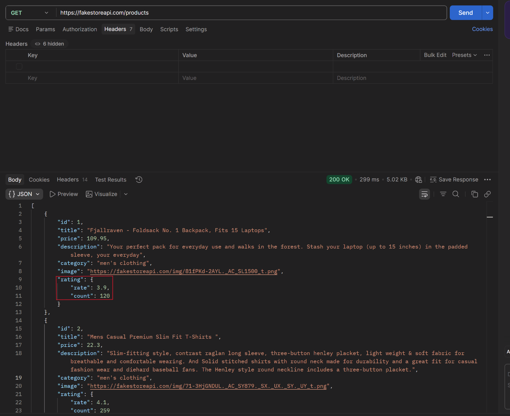

---

## BUG-002

| Поле | Значение |
|---|---|
| **ID** | BUG-002 |
| **Заголовок** | Отсутствие проверки существования/корректности id в GET /products/{id} |
| **Описание** | При проверке существования/корректности id в запросах к GET /products/{id}, при любом некорректном id (нечисловой, дробный, несуществующий, отрицательный) сервер возвращает код 200 Success, вместо 400 Bad Request или 404 Not Found. |
| **Шаги воспроизведения** | 1. Открыть Postman. 2. Нажать "+" ("Add request"). 3. Выбрать метод GET. 4. В поле URL вставить запрос `https://fakestoreapi.com/products/{id}` с несуществующим, нулевым, отрицательным, дробным или нечисловым id. 5. Нажать Send. 6. Изучить полученный ответ (код состояния, тело ответа, заголовки). |
| **Фактический результат** | Сервер возвращает код 200 Success с пустым телом. |
| **Ожидаемый результат** | Сервер вернёт код 400 Bad Request или код 404 Not Found. |
| **Окружение** | Postman, fakestoreapi.com, Windows 11 |
| **Дополнительная информация** | Наблюдение произведено неоднократно: 1. TC-PROD-012 (несуществующий id) 2. TC-PROD-013 (id=0) 3. TC-PROD-014 (id=21) 4. TC-PROD-015 (id=-1) 5. TC-PROD-016 (id=20,5 — дробное) 6. TC-PROD-017 (id=abc — нечисловое) |

**Вложения:**

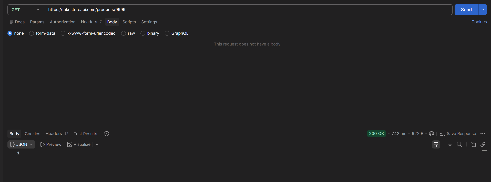
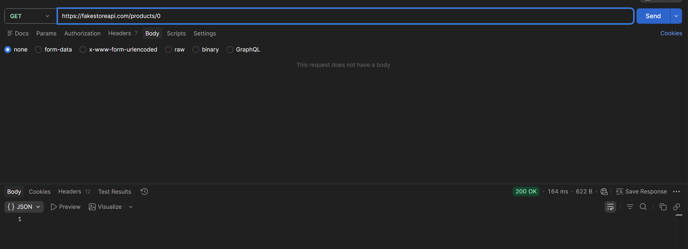
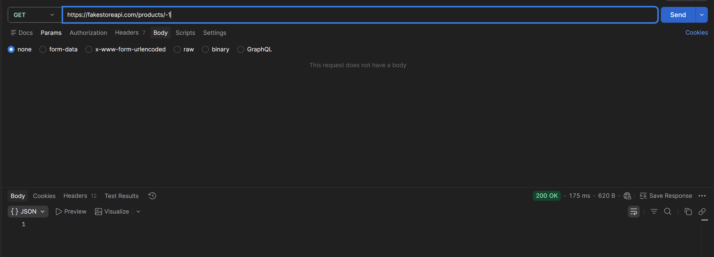
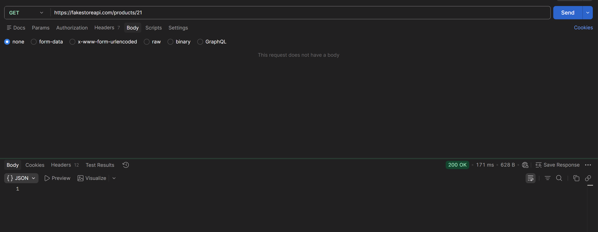
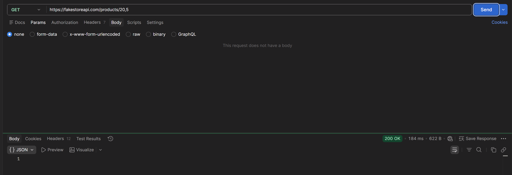
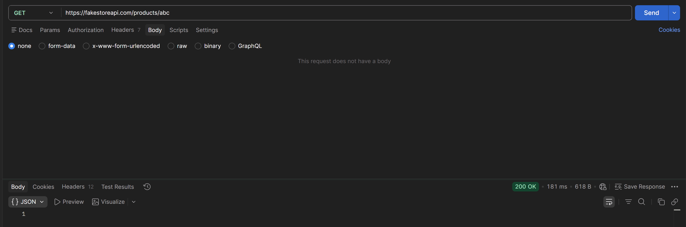

---

## BUG-003

| Поле | Значение |
|---|---|
| **ID** | BUG-003 |
| **Заголовок** | Отсутствие проверки существования id в PUT /products/{id} |
| **Описание** | При проверке существования id в запросах к PUT /products/{id}, при любом несуществующем id сервер возвращает код 200 Success с телом, включающим новый id и данные полей, вместо 400 Bad Request или 404 Not Found. |
| **Шаги воспроизведения** | 1. Открыть Postman. 2. Нажать "+" ("Add request"). 3. Выбрать метод PUT. 4. В поле URL вставить запрос `https://fakestoreapi.com/products/{id}` с несуществующим (0, 9999 и т.д.) id. 5. В теле запроса (Body → raw → JSON) указать новые данные продукта, например: `{"title": "string", "price": 0.1, "description": "string", "category": "string", "image": "http://example.com"}`. 6. Нажать Send. 7. Изучить полученный ответ (код состояния, тело ответа, заголовки). |
| **Фактический результат** | Сервер возвращает код 200 Success с телом, включающим новый id и данные полей. |
| **Ожидаемый результат** | Сервер вернёт код 400 Bad Request или код 404 Not Found. |
| **Окружение** | Postman, fakestoreapi.com, Windows 11 |
| **Дополнительная информация** | Наблюдение произведено на основе двух тест-кейсов TC-PROD-019 и TC-PROD-020. В отличие от отсутствующей проверки существования, PUT корректно проверяет тип id (нечисловой/дробный id возвращает 400 Bad Request — см. TC-PROD-021, TC-PROD-022). |

**Вложения:**

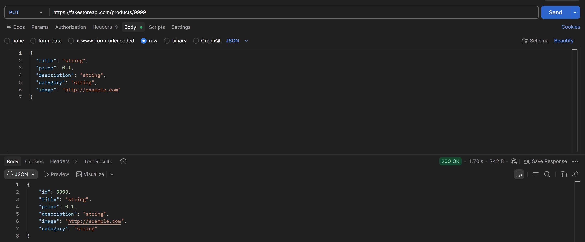
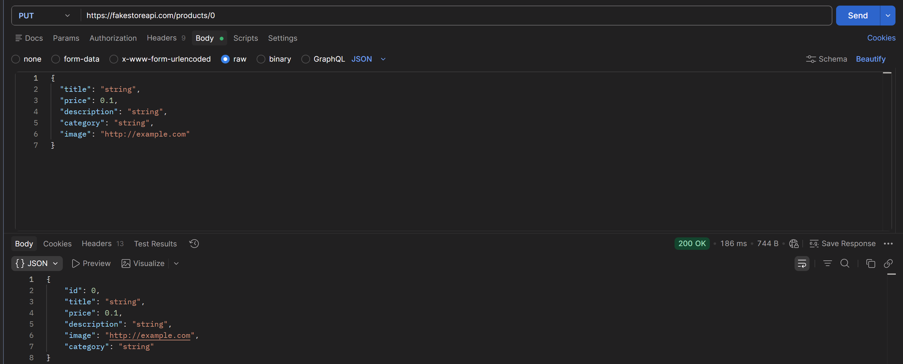

---

## BUG-004

| Поле | Значение |
|---|---|
| **ID** | BUG-004 |
| **Заголовок** | Отсутствие проверки существования id в DELETE /products/{id} |
| **Описание** | При проверке существования id в запросах к DELETE /products/{id}, при любом несуществующем id сервер возвращает код 200 Success, вместо 400 Bad Request или 404 Not Found. |
| **Шаги воспроизведения** | 1. Открыть Postman. 2. Нажать "+" ("Add request"). 3. Выбрать метод DELETE. 4. В поле URL вставить запрос `https://fakestoreapi.com/products/{id}` с несуществующим (0, 9999 и т.д.) id. 5. Нажать Send. 6. Изучить полученный ответ (код состояния, тело ответа, заголовки). |
| **Фактический результат** | Сервер возвращает код 200 Success с пустым телом. |
| **Ожидаемый результат** | Сервер вернёт код 400 Bad Request или код 404 Not Found. |
| **Окружение** | Postman, fakestoreapi.com, Windows 11 |
| **Дополнительная информация** | Наблюдение произведено на основе двух тест-кейсов TC-PROD-024 и TC-PROD-025. В отличие от отсутствующей проверки существования, DELETE корректно проверяет тип id (нечисловой/дробный id возвращает 400 Bad Request — см. TC-PROD-026, TC-PROD-027). |

**Вложения:**

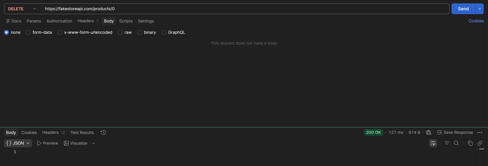
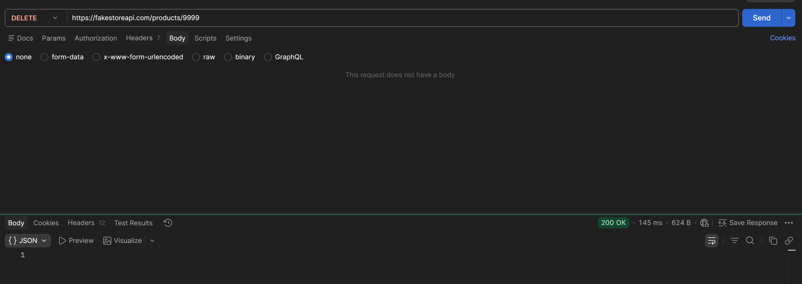
